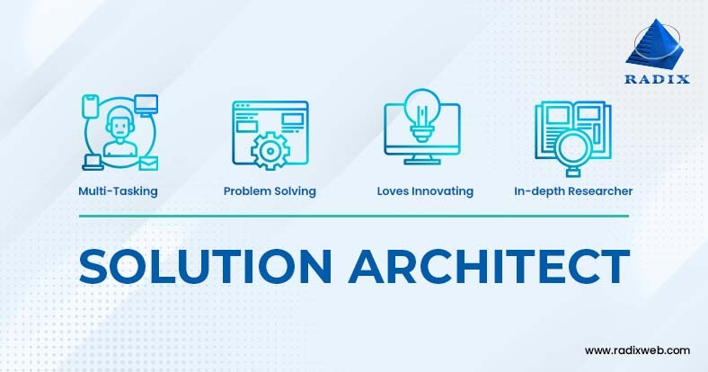

**1. Role Description, Technical, and Non-Technical Requirements
Role Overview:**

A Computer Systems Engineer/Architect, often referred to as a Solutions Architect, is responsible for designing and integrating complex IT systems that meet the needs of organizations. This involves a high-level understanding of hardware, software, networking, and cloud environments to ensure the seamless integration of technology within business operations.

*Technical Requirements:*

- System Architecture Design: Expertise in creating system architectures that define hardware, software, and networking components.

- Cloud Platforms: Proficiency with cloud services such as AWS, Azure, or Google Cloud, including cloud migration strategies and cloud-native architecture.

- Programming and Scripting Languages: Knowledge of Python, Java, C#, or scripting languages like Bash or PowerShell to support system integration and automation.

- Networking: Strong understanding of networking fundamentals (TCP/IP, DNS, VPNs) and how they fit into overall systems architecture.

- Virtualization and Containers: Experience with virtualization technologies like VMware and containerization platforms like Docker and Kubernetes for scalable deployment.

- Security Protocols: Knowledge of security standards, encryption, firewalls, and ensuring system architecture complies with security best practices.

*Non-Technical Requirements:*

- Analytical Thinking: Ability to understand complex business needs and translate them into effective technical solutions.
- Collaboration and Leadership: Work closely with teams across departments, including developers, network engineers, and business stakeholders.
- Problem-Solving: Tackling intricate system-related issues and developing long-term, scalable solutions.
- Project Management: Overseeing the entire lifecycle of system implementation, from planning to deployment, requiring time management and organization skills.
**2. My Thoughts on the Role**

The role of a Solutions Architect is critical in modern organizations, especially as businesses increasingly move towards digital and cloud solutions. I find this role particularly interesting because it combines technical acumen with strategic business planning. It allows you to make a tangible impact on how systems perform and support the business, ensuring that technology effectively aligns with organizational goals. The role offers opportunities to work on large-scale projects and collaborate with various teams, which I find exciting and dynamic.

**3. Skills I Need to Learn and the Role of Education
To achieve the role of a Solutions Architect, I would need to enhance the following skills:**

- Cloud Architecture Expertise: I would need to deepen my understanding of cloud services and architectures, particularly around hybrid and multi-cloud deployments.

- Systems Integration: Gaining proficiency in integrating various IT components into cohesive systems, ensuring compatibility, and optimizing for performance.

- Security Architecture: Learning more about security best practices to ensure that the architectures I design are resilient against attacks and data breaches.

***Do I Think the Role Requires a College Education?***

While a degree in computer science, IT, or engineering can be helpful, the role of a Solutions Architect emphasizes experience and skills. Hands-on experience, certifications (e.g., AWS Certified Solutions Architect, Google Cloud Professional Architect), and a deep understanding of system architecture are often more important than formal education alone. Many successful Solutions Architects have developed their careers through a combination of self-study, certifications, and real-world experience.

**4. Additional Activities and Tasks to Achieve the Role**
- Certifications: Obtaining certifications like AWS Certified Solutions Architect, Microsoft Certified: Azure Solutions Architect Expert, or Google Cloud Professional Cloud Architect will demonstrate expertise in cloud and system architecture.
- Building and Testing Solutions: Gaining experience by designing, building, and testing system architectures in lab environments or through personal projects will hone my practical skills.
- Industry Engagement: Participating in architecture and cloud computing forums, conferences, and networking events will help me stay up to date with industry trends and best practices.
- Mentorship and Shadowing: Finding a mentor in the field or shadowing experienced Solutions Architects will provide insight into real-world challenges and solutions, offering valuable learning experiences.

**Conclusion:**
The role of a Solutions Architect requires a blend of technical expertise, business acumen, and leadership skills. It's a role that enables you to shape the future of technology within organizations by designing systems that are scalable, secure, and aligned with business needs. While the path to this role involves certifications and hands-on experience, it also provides an opportunity for creative problem-solving and making significant impacts on a company's digital strategy.